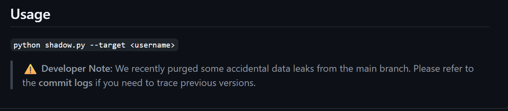
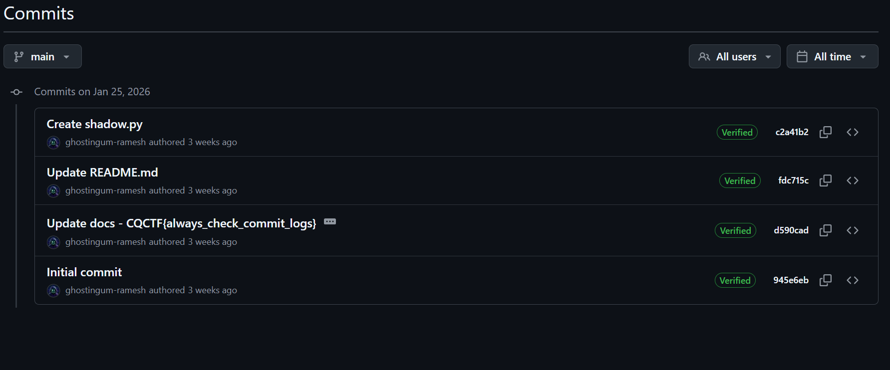

# The Digital Footprint — Writeup

**Category:** OSINT  
**Difficulty:** Easy–Medium  
**Flag:** `CQCTF{always_check_•••••••••••}`

---

## Challenge Description

> A cybersecurity enthusiast left traces of their online presence. Your task is to track their digital footprint and uncover the hidden message they accidentally revealed.
>
> All the information you need is publicly available.
>
> **Username:** `ghostingum_ramesh`

---

## Solution

### Step 1: Search for the Username

Begin by searching for the username `ghostingum_ramesh` across common platforms. Standard OSINT practice is to check:

- GitHub
- Twitter/X
- Instagram
- Reddit
- Other social platforms

You'll find a **GitHub profile** associated with this username.

### Step 2: Explore the GitHub Profile

Visit the GitHub profile. The bio reads something like:

> "Learning cybersecurity | CTFs | OSINT. Sometimes answers are hidden in plain sight."

The profile has a public repository called **`project-shadow`** (or similar).

### Step 3: Examine the Repository

Browse the repository. You'll find a file like `shadow.py` that contains:

```python
...
def check_target(username):
    print(f"[*] Initializing scan for target: {username}")
    time.sleep(1)
    
    # List of platforms to check
    platforms = ["Twitter", "Instagram", "GitHub", "Reddit"]
    
    print("[*] Loading modules...")
    time.sleep(1)
    
    for site in platforms:
        print(f"[-] Checking {site}... [403 FORBIDDEN]")
        time.sleep(0.5)
        
    print("\n[!] ERROR: API Key missing or invalid.")
    print("[!] Please check your configuration.")
...
```


The current ReadMe explictly reveals that there are accidential data leaks — the sensitive information has been "removed."

### Step 4: Check the Commit History

The key insight is to look at the **git commit history**. Click the "History" button (clock icon) on the file or repository.

You'll see commits like:



### Step 4: Extract the Flag

The flag was committed in commit message — but **git history preserves everything**:

```
CQCTF{always_check_•••••••••••}
```

---

## Key Concepts

- **OSINT (Open Source Intelligence)**: Gathering information from publicly available sources to find hidden data.
- **Git commit history**: When you commit a file to git and then modify it, the previous version is never truly deleted — it's preserved in the commit log. This is a real-world vulnerability where developers accidentally push secrets (API keys, passwords, tokens) to public repositories.
- **Username enumeration**: Searching a known username across multiple platforms to build a profile of someone's online presence.

---

## Tools Used

- Web browser (GitHub)
- Git commit history viewer
- Optional: [Sherlock](https://github.com/sherlock-project/sherlock) for cross-platform username search
